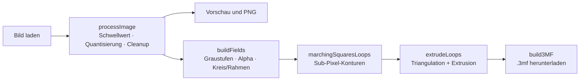
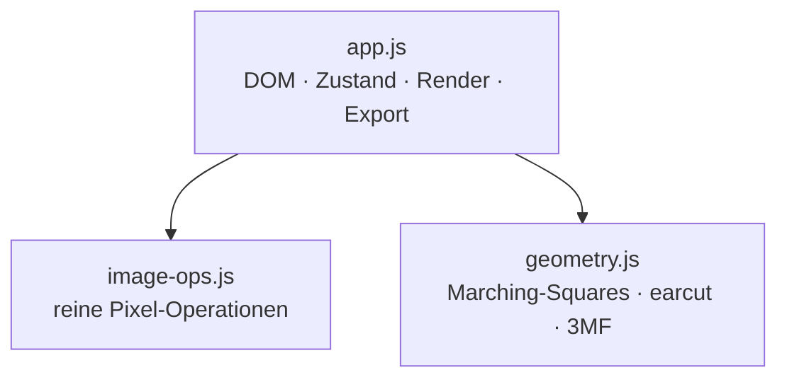

<div align="center">


# Ukibori · 浮彫

**Verwandle jedes Bild in ein erhabenes 3D-Relief — direkt im Browser.**

Schwarz-Weiß & flache Farben · druckfertiger `.3mf`-Export · 100 % lokal.


</div>

---

## ✨ Warum Ukibori?

> *Ukibori* (jap. **浮彫**, „erhabenes Relief") macht aus einem Foto, Logo oder
> Schriftzug in Sekunden ein **physisches Objekt** — ohne CAD, ohne Konto, ohne
> Cloud.

- 🧩 **Vom Bild zum Druck in einem Schritt.** Laden, Schwellwert ziehen, `.3mf`
  exportieren — fertig für den Slicer. Jede Farbe wird als eigenes Objekt
  ausgegeben, ideal für **Mehrfarb-/AMS-Druck**.
- 🪶 **Glatt statt verpixelt.** Sub-Pixel-Konturen liefern weiche Kurven und
  saubere runde Ränder — auch bei niedriger Auflösung (siehe [Technik](#-wie-es-funktioniert)).
- 🔒 **Deine Bilder bleiben deine.** Alles rechnet im Browser. Kein Upload,
  kein Server, kein Tracking — funktioniert sogar offline.
- ⚡ **Null Installation.** Eine `index.html`. Kein Build, keine Abhängigkeiten,
  keine Toolchain.

**Wofür?** Untersetzer · Tür- & Regalschilder · Logo-Plaketten · Kühlschrank­magnete · Stempel-Vorlagen · Deko-Reliefs.

---

## 🎨 Funktionen

| Schwarz / Weiß | Farben reduzieren | Runder Untersetzer |
| :---: | :---: | :---: |
|  |  |  |
| Schwellwert · Auto (Otsu) · Invertieren · Inseln entfernen | Palette (Median-Cut) oder Posterize · Kanten glätten | Verschieb- & zoombarer Kreis · Rahmen in Wunschfarbe |

- **Zwei Konvertierungsmodi** — kontrastreiches Schwarz-Weiß oder flache,
  poster­artige Farbflächen.
- **Kreis-Zuschnitt** mit erhabenem Rand — der klassische runde Untersetzer.
- **Transparenz erhalten** — freigestellte Motive bleiben transparent (Vorschau,
  PNG **und** 3D: transparente Bereiche werden ausgespart).
- **3D-Relief-Export (`.3mf`)** — einstellbare Dicken für Schwarz/Weiß,
  **Grundplatte**, **Rand/Rahmen** (rund oder rechteckig), Auflösung und
  Glättung; mit und ohne Kreis-Zuschnitt.
- **PNG-Export** der umgewandelten Grafik.
- **Live-Vorschau** mit Karomuster für Transparenz, responsives Layout.

---

## 🚀 Loslegen

Kein Build-Schritt, keine Installation.

```sh
# Variante A — einfach öffnen
open index.html            # bzw. Doppelklick im Dateimanager

# Variante B — lokal servieren (empfohlen)
python3 -m http.server 8000
# → http://localhost:8000/
```

Dann: **Bild per Drag & Drop laden → Parameter in der Seitenleiste einstellen →
PNG oder 3D-Modell (.3mf) exportieren.**

---

## 🧠 Wie es funktioniert

Eine Bild-Pipeline für die 2D-Ausgabe, und ein darauf aufbauender Feld-basierter
Pfad für das glatte 3D-Modell:



### Glatte Kanten statt Pixel-Treppe

Naive Bild-zu-Relief-Konverter ziehen die Kontur entlang der **Pixelkanten** —
das Ergebnis ist eine sichtbare Treppe. Ukibori übersetzt das Bild stattdessen in
**kontinuierliche Felder** (Graustufen-Deckungsgrad für Schwarz/Weiß, Alpha für
Transparenz, analytische Distanzfelder für Kreis & Rahmen) und extrahiert die
Kontur per **interpolierter Marching-Squares** mit Sub-Pixel-Genauigkeit.

<div align="center">

</div>

Das Relief wird in z-Schichten gestapelt: **Grundplatte** → **Relief**
(Schwarz/Weiß in eigenen Dicken) → **Rand/Ring** — jede Komponente als eigenes,
eingefärbtes Objekt im `.3mf`. Der **Glättung**-Regler dient nur noch der
optionalen leichten Nachglättung.

### Architektur



| Datei | Rolle |
| --- | --- |
| `index.html` | Markup, Einbindung von CSS/JS, Favicon |
| `styles.css` | Layout, Sidebar, Akkordeon-Optionen |
| `js/image-ops.js` | Schwellwert, Otsu, Inseln, Posterize, Median-Cut, Kreismaske |
| `js/geometry.js` | Sub-Pixel-Konturen, Triangulation (earcut), ZIP/3MF-Erzeugung |
| `js/app.js` | DOM, Zustand, Render-Pipeline, Events, Export |
| `favicon.svg` | Marken-Favicon (Kanji 浮, geprägt) |
| `docs/superpowers/specs/` | Design-Dokumente je Feature |

Reines HTML/CSS/JavaScript — keine Frameworks, keine externen Bibliotheken.

---

## 🔒 Datenschutz

Die gesamte Verarbeitung passiert lokal im Browser. Bilder werden **nicht**
hochgeladen, gespeichert oder an Dritte gesendet. Die App funktioniert auch
vollständig offline.

---

## 📚 Mehr

Die Entwurfs-/Design-Dokumente der einzelnen Features liegen unter
[`docs/superpowers/specs/`](docs/superpowers/specs/) — von der ersten
Schwarz-Weiß-Konvertierung über den Rechteck-Relief-Export und die
Transparenz-Unterstützung bis zur Sub-Pixel-Kontur.

<div align="center">
<sub>Komplett lokal im Browser gebaut · 浮彫</sub>
</div>
