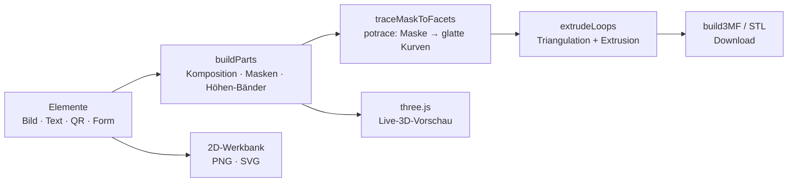
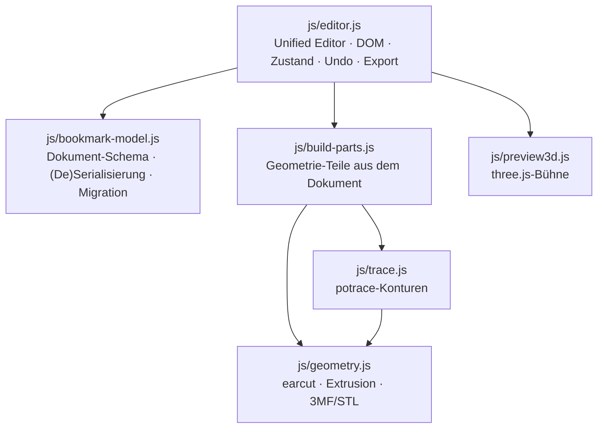

<div align="center">


# Ukibori · 浮彫

**Verwandle Bilder, Text und Formen in 3D-Reliefs — direkt im Browser.**

Bild · Text · QR · Rechteck & Kreis → Relief · Erhaben & Vertieft · AMS-Mehrfarbdruck · KI-Freistellung · Live-3D · 100 % lokal.


</div>

---

## ✨ Warum Ukibori?

> *Ukibori* (jap. **浮彫**, „erhabenes Relief") macht aus einem Foto, Logo oder
> Schriftzug in Sekunden ein **physisches Objekt** — ohne CAD, ohne Konto, ohne
> Cloud.

- 🧩 **Vom Entwurf zum Druck in einem Schritt.** Elemente aufs Werkstück legen,
  Regler ziehen, `.3mf` exportieren — fertig für den Slicer. Jede Komponente
  wird als eigenes, einfarbiges Objekt ausgegeben, ideal für
  **Mehrfarb-/AMS-Druck**.
- 🪶 **Glatt statt verpixelt.** Vektorisierte Konturen (potrace) liefern weiche
  Kurven und saubere runde Ränder — auch bei niedriger Auflösung (siehe
  [Technik](#-wie-es-funktioniert)).
- 🔒 **Deine Bilder bleiben deine.** Alles rechnet im Browser. Kein Upload,
  kein Server, kein Tracking — funktioniert sogar offline.
- ⚡ **Kein Build, kein CDN.** Läuft aus statischen Dateien ohne Toolchain. Die
  genutzten Bibliotheken (three.js, ONNX-Laufzeit + Freistell-Modell, QR-Encoder,
  potrace) sind **lokal mitgeliefert** — zur Laufzeit wird nichts nachgeladen.

**Wofür?** Untersetzer · Tür- & Regalschilder · Logo-Plaketten · Kühlschrank­magnete · Schlüsselanhänger · Namens- & WLAN-QR-Schilder · Stempel-Vorlagen · Deko-Reliefs.

---

## 🖼️ Die Werkstatt

Ein Dreispalter im „Papier & Tusche"-Look: links das **Dokument**-Panel
(Werkstück · Stapelung · Druck), in der Mitte die **Bühne** mit 2D-Werkbank und
dunkler 3D-Ansicht (umschaltbar **2D / 3D / Geteilt**), rechts der
**Element-Inspektor** mit Add-Dock und darunter das **Ebenen-Dock** im
Photoshop-Stil. Rückgängig/Wiederholen, Einrasten-Optionen und der
Export-Dialog sitzen in der Topbar.

| 2D-Werkbank | Erhaben | Vertieft |
| :---: | :---: | :---: |
|  |  |  |
| Ziehen, Skalieren, Drehen, Einrasten — mit Hilfslinien | Motive stapeln als Prismen auf der Platte | Motive gravieren in die Platte; die Farbbänder bleiben sichtbar |

- **Ebenen-Dock** — jede Zeile mit Miniatur/Chip und Druck-Badge (↑/↓ Höhe in
  mm, ✎ bei manuellem Override, „bündig"; bei Farbebenen/Höhenrelief der Modus),
  Einfarbig-Zeilen zusätzlich mit Farbpunkt; per **Drag & Drop sortierbar**,
  beim Hover erscheinen Auge, Duplizieren (⧉), ▲/▼ und Papierkorb.
- **Schwebende Auswahl-Toolbar** auf der Bühne: Duplizieren, Zentrieren (↔/↕),
  **Spiegeln H/V** und Löschen.
- **Schicht-Vorschau** — ein Slider kappt das 3D-Modell wie ein Slicer-Scrubber
  stufenlos von oben.
- **Rückgängig/Wiederholen** über das ganze Dokument (bis zu 30 gespeicherte
  Zustände, <kbd>Strg/Cmd</kbd>+<kbd>Z</kbd>).
- **Einrasten** — an Plattenkanten/-mitte, an anderen Elementen oder auf einem
  mm-Raster, mit gestrichelten Hilfslinien beim Ziehen; einstellbar über das
  Schloss-Popover in der Topbar (bleibt lokal gespeichert).
- **Dünne Stellen prüfen** — markiert Bereiche schmaler als die 0,4-mm-Düse als
  rotes Overlay in der 2D-Ansicht, bevor der Druck sie verschluckt.
- **Leere Bühne?** Eine klickbare Hero-Karte begrüßt — Klick öffnet den
  Bild-Dialog, Drag & Drop landet direkt auf dem Werkstück.

---

## 🎨 Funktionen

### Elemente

- **Fünf Element-Typen** — **Bild** laden, **Text** tippen, **QR-Code**
  erzeugen oder eine Form (**Rechteck** / **Kreis**) aufziehen; alle fließen in
  dieselbe Relief-Pipeline.
- **Formen sind Vektoren** — Rechteck und Kreis werden bei jeder Größe und
  Auflösung gestochen scharf gerastert; der Kreis wird zur **Ellipse**, sobald
  Breite ≠ Höhe, und die Art ist im Inspektor nachträglich umschaltbar.
- **Spiegeln** — jedes Element horizontal/vertikal kippen; der Zustand wirkt in
  2D, 3D und allen Exporten.
- **Duplizieren** — per <kbd>Strg/Cmd</kbd>+<kbd>D</kbd>, über die
  Auswahl-Toolbar oder direkt als ⧉-Aktion in der Ebenen-Zeile; die Kopie landet
  leicht versetzt über dem Original.
- **Drei Tiefenmodi je Element** — **Einfarbig** (Silhouette per Schwellwert),
  **Farbebenen** (Palette per Median-Cut) oder **Höhenrelief** (Helligkeit →
  Höhe, fein abgestuft in Druckschichten).
- **Als Loch ausschneiden** — jedes Element kann statt zu drucken die Platte
  durchstanzen.
- **KI-Freistellung** — lokales Modell (u2netp via onnxruntime-web) entfernt den
  Bildhintergrund direkt im Browser; das Bild verlässt das Gerät nicht.
  *(Erfordert HTTP-Serving — „Variante B" unten; per Doppelklick/`file://` ist die Funktion deaktiviert.)*
- **Transparenz erhalten** — freigestellte Motive bleiben transparent
  (Vorschau, PNG **und** 3D: transparente Bereiche werden ausgespart).
- **Schriftarten** — System-Schriften + **Fett**, oder eine eigene
  **`.ttf`/`.otf`/`.woff`/`.woff2`** laden (lokal eingebettet und im Projekt
  gespeichert).

### Werkstück

- **Vier Plattenformen** — **Rechteck** (mit Eckenradius), **Kreis**, **Frei**
  (die Platte folgt der Bildsilhouette) oder **Bild** (plattenloses Objekt).
- **Rahmen** in Wunschbreite, -höhe und -farbe — der klassische
  Untersetzer-Rand; bei der Freiform folgt der Ring der Außenkontur.
- **Befestigung** — **Loch** zum Aufhängen/Verschrauben oder **Öse**
  (angesetzte Lasche mit Loch), per ziehbarem Marker platziert — die Öse
  bleibt dabei stets mit dem Plattenrand verbunden.

### Relief & Farben

- **Erhaben oder Vertieft** — global für alle Ebenen und zusätzlich je Element
  umschaltbar (bei Einfarbig und Farbebenen; Höhenreliefs bauen immer nach
  oben auf der Platte auf).
- **Farb-Relief, drei Stapel-Stile** — **Gestuft** (Rang-Höhen), **Eine Fläche**
  (alle Farben auf einer Ebene) oder **AMS-Farbschichten** (eine Farbe pro
  Druck­schicht, gemacht für Filament-Wechsel).
- **AMS-Filament-Palette** — eine gemeinsame, geordnete Farbschicht-Liste fürs
  ganze Modell: Farben **hinzufügen**, per **Ziehen umsortieren** oder
  **entfernen** — die Pixel einer entfernten Farbe rasten auf die ähnlichste
  verbleibende Schicht (glättet verrauschte Bilder). Alle AMS-Elemente (und
  über „Höhe je Farbe" auch Einfarbig-Elemente) rasten auf dieselben Schichten
  ein; explizites **Zusammenführen** zweier Farben bietet die Element-Palette
  der Stile Gestuft/Eine Fläche.
- **Höhe je Farbe (AMS-Ebenen)** — Einfarbig-Elemente bekommen ihre Höhe
  automatisch aus ihrer Farbe: gleiche Farbe = gleiche Ebene, jede weitere
  Farbe eine Stufe höher. <details><summary>Details</summary>

  - **Erhaben** druckt das Werkstück als **einen** Stapel massiver einfarbiger
    Vollschichten — untere Farben laufen unter höheren durch, jede
    Druck­schicht bleibt einfarbig.
  - **Vertieft** teilt stattdessen die Grundplatte in massive Farbbänder; die
    Plattenoberseite bleibt — ohne Deckschicht — ein durchgehendes
    Grundfarben-Band, und grundfarbene Elemente bleiben bündig darin. Auch der
    Rahmen-Unterbau bandet mit.
  - Die **Deckschicht** legt optional eine eigene Farbe als oberste Ebene aufs
    Werkstück — erhaben als Fläche über der Platte, auf der die Farb-Motive
    stapeln (grundfarbene und manuell fixierte Elemente stanzen weiterhin
    durch); vertieft als oberstes Plattenband, durch das die Motive gravieren.
  - Die **Relief-Höhe** wirkt als manueller Override pro Element (der
    Platzhalter zeigt den Auto-Wert, der **Auto**-Knopf stellt ihn wieder her).
  - Abschaltbar per Häkchen; alte Projekte behalten ihre manuellen Höhen.
  </details>

### Vorschau, Speichern & Export

- **Live-3D-Vorschau** — dreh-, zoom- und schwenkbare three.js-Ansicht des
  exakten Druck­modells; die Kamera startet von vorn, leicht schräg aufs
  Werkstück.
- **Export-Dialog** — **PNG**, vektorisiertes **SVG** (potrace), **`.3mf`**
  (jede Komponente als eigenes, einfarbiges Objekt — ideal für
  Mehrfarb-/AMS-Druck) und universelles **`.stl`**, mit eigenem Dateinamen; der
  Name des zuerst geladenen Bildes wird automatisch vorgeschlagen.
- **Speichern / Öffnen** — Projekt als `.json`-Datei herunterladen und wieder
  laden (vollständige Rundreise inkl. Bildquellen, Schriften und
  Tiefen-Einstellungen).

---

## ⌨️ Tastatur & Maus

| Kürzel | Wirkung |
| --- | --- |
| <kbd>Strg/Cmd</kbd>+<kbd>Z</kbd> · <kbd>Strg/Cmd</kbd>+<kbd>⇧</kbd>+<kbd>Z</kbd> | Rückgängig · Wiederholen |
| <kbd>Strg/Cmd</kbd>+<kbd>D</kbd> | Ausgewähltes Element duplizieren |
| <kbd>Entf</kbd> / <kbd>⌫</kbd> | Ausgewähltes Element löschen |
| <kbd>Tab</kbd> / <kbd>⇧</kbd>+<kbd>Tab</kbd> | Nächstes/vorheriges Element auswählen |
| <kbd>Pfeiltasten</kbd> · mit <kbd>⇧</kbd> | Element 1 mm verschieben · fein (0,25 mm) |
| <kbd>⇧</kbd> beim Eck-Skalieren | Seitenverhältnis halten |
| <kbd>Esc</kbd> | Auswahl aufheben |

**3D-Bühne:** Ziehen = Drehen · Rechte/mittlere Taste oder <kbd>⇧</kbd>+Ziehen = Schwenken · Mausrad = Zoom.

---

## 🚀 Loslegen

Kein Build-Schritt, keine Installation.

```sh
# Variante A — einfach öffnen
open index.html            # bzw. Doppelklick im Dateimanager

# Variante B — lokal servieren (empfohlen, schaltet die KI-Freistellung frei)
python3 -m http.server 8000
# → http://localhost:8000/
```

Dann: **Bild per Drag & Drop laden (oder + Text / + QR / + Rechteck / + Kreis) →
Parameter einstellen → PNG oder 3D-Modell (.3mf) exportieren.**

---

## 🧠 Wie es funktioniert

Die 2D-Werkbank rendert das Dokument WYSIWYG auf ein Canvas; PNG- und
SVG-Export nutzen dieselbe Zeichenroutine auf eigenen Offscreen-Canvases im
Druckraster. Für das 3D-Modell rastert die Engine jedes Element in Masken auf
dem Druckraster und zeichnet die Konturen als glatte Kurven nach:



### Glatte Kanten statt Pixel-Treppe

Naive Bild-zu-Relief-Konverter ziehen die Kontur entlang der **Pixelkanten** —
das Ergebnis ist eine sichtbare Treppe. Ukibori rastert das Dokument stattdessen
auf ein feines mm-Raster — Plattenform, Rahmen und Öse aus analytischen
Distanzfeldern, Bilder und Text über ihren Alphakanal — und vektorisiert die
entstandene Maske mit dem lokal mitgelieferten **potrace** zu glatten
**Bézier-Kurven**, statt den Pixelkanten zu folgen.

<div align="center">

</div>

Das Modell wird in z-Schichten gestapelt: **Grundplatte** (ggf. in Farbbänder
geteilt) → **Elemente** (Prismen bzw. Gravuren) → **Rahmen/Öse** — jede
Komponente als eigenes, eingefärbtes Objekt im `.3mf`.

### Architektur



| Datei | Rolle |
| --- | --- |
| `index.html` | Markup: Topbar, drei Panels, Bühne, Export-Dialog, Favicon |
| `styles.css` | Werkstatt-Look „Papier & Tusche", Dreispalter, Ebenen-Dock |
| `js/editor.js` | Unified Editor: DOM & Zustand, Canvas-Rendering, Auswahl/Drag/Einrasten, Undo, Speichern/Öffnen, Export-Dialog, 2D/3D/Geteilt |
| `js/bookmark-model.js` | v2-Dokument-Schema (`defaultDoc`, `makeElementV2`), Serialisierung, Migration von v1 |
| `js/build-parts.js` | baut die Geometrie-Teile (Platte, Farbbänder, Elemente, Rahmen, Öse) für 3D-Vorschau und Export |
| `js/bookmark-export.js` | Paletten-Helfer (Median-Cut, Farbzuordnung); dazu der alte v1-Export-Pfad, heute Referenz für Paritäts-Tests |
| `js/geometry.js` | Extrusion & Triangulation (earcut), Distanzfelder der Plattenformen, 3MF/STL-Erzeugung |
| `js/image-ops.js` | reine Pixel-Operationen: Schwellwert, Inseln, Median-Cut, … |
| `js/sources.js` | Text- & QR-Eingabe → ImageData |
| `js/bg-removal.js` | KI-Freistellung (u2netp via onnxruntime-web) |
| `js/preview3d.js` | Live-3D-Vorschau (three.js, Szene aus `buildParts()`) |
| `js/trace.js` · `js/vendor/potrace.js` | potrace-Konturierung: Masken → glatte Kurven für alle 3D-Teile und den SVG-Export |
| `js/coachmarks.js` | Erster-Start-Tour (Coach-Marks) |
| `vendor/` | lokal mitgeliefert: three.js, onnxruntime-web (+ WASM) mit `u2netp.onnx`, QR-Encoder |
| `tests/` | Browser-Test-Suite — `tests/run.html` führt alle `*.test.js` aus (221 Tests) |
| `docs/superpowers/specs/` · `docs/superpowers/plans/` | Design- & Umsetzungs-Dokumente je Feature |

Reines HTML/CSS/JavaScript, **kein Build-Schritt und kein CDN**. Einige Funktionen
(3D-Vorschau, KI-Freistellung, QR, SVG-Tracing) nutzen Bibliotheken, die **lokal
mitgeliefert** werden — zur Laufzeit wird nichts aus dem Netz nachgeladen.

---

## 🔒 Datenschutz

Die gesamte Verarbeitung passiert lokal im Browser. Bilder werden **nicht**
hochgeladen, gespeichert oder an Dritte gesendet — auch die **KI-Freistellung**
läuft mit einem lokal mitgelieferten Modell direkt im Browser. Die App funktioniert
vollständig offline.

---

## 📚 Mehr

Die Entwurfs-/Design-Dokumente früher Meilensteine liegen unter
[`docs/superpowers/specs/`](docs/superpowers/specs/) — von der ersten
Schwarz-Weiß-Konvertierung über die glatte Kontur bis zum einheitlichen
v2-Editor und zur Freiform-Platte.

<div align="center">
<sub>Komplett lokal im Browser gebaut · 浮彫</sub>
</div>
