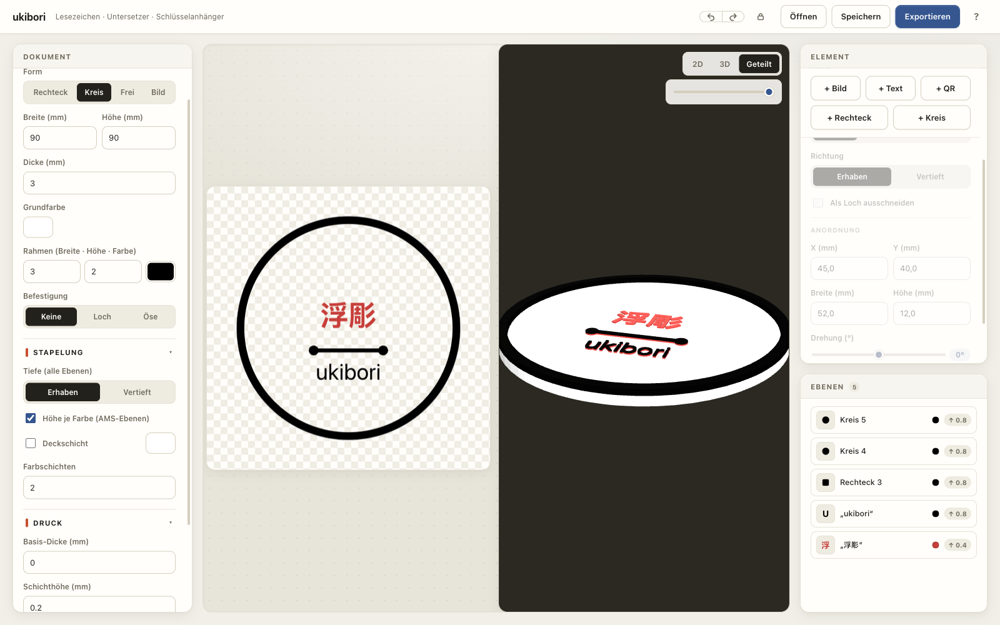
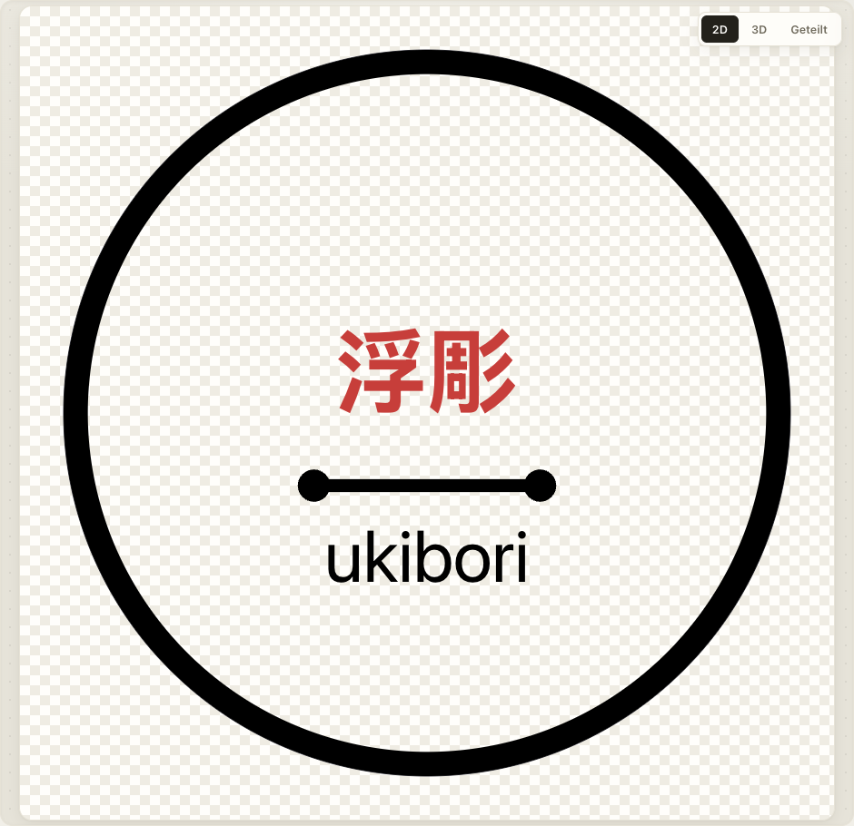
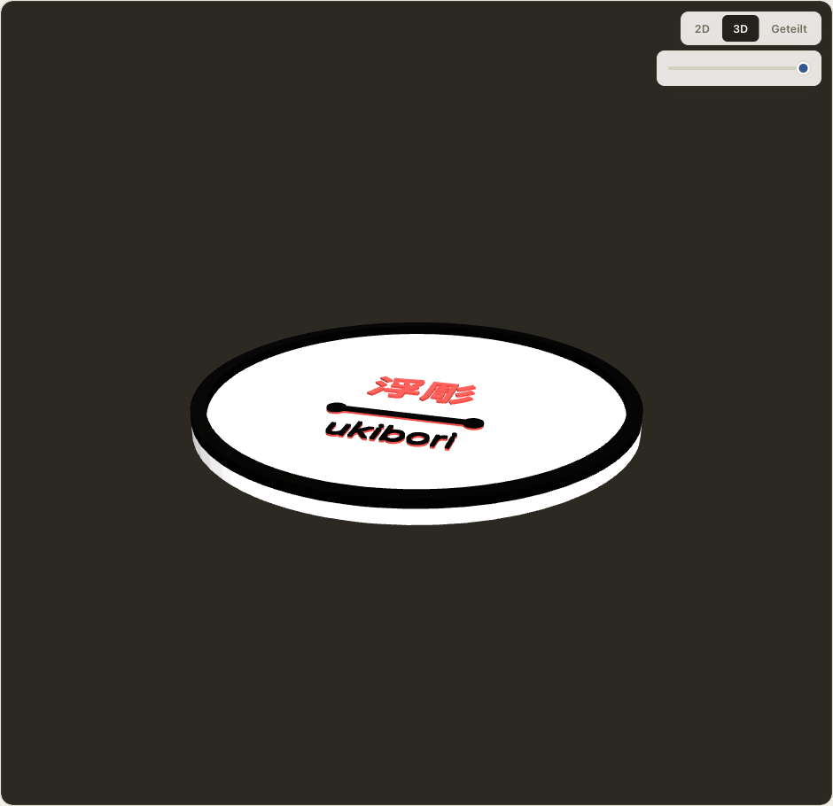
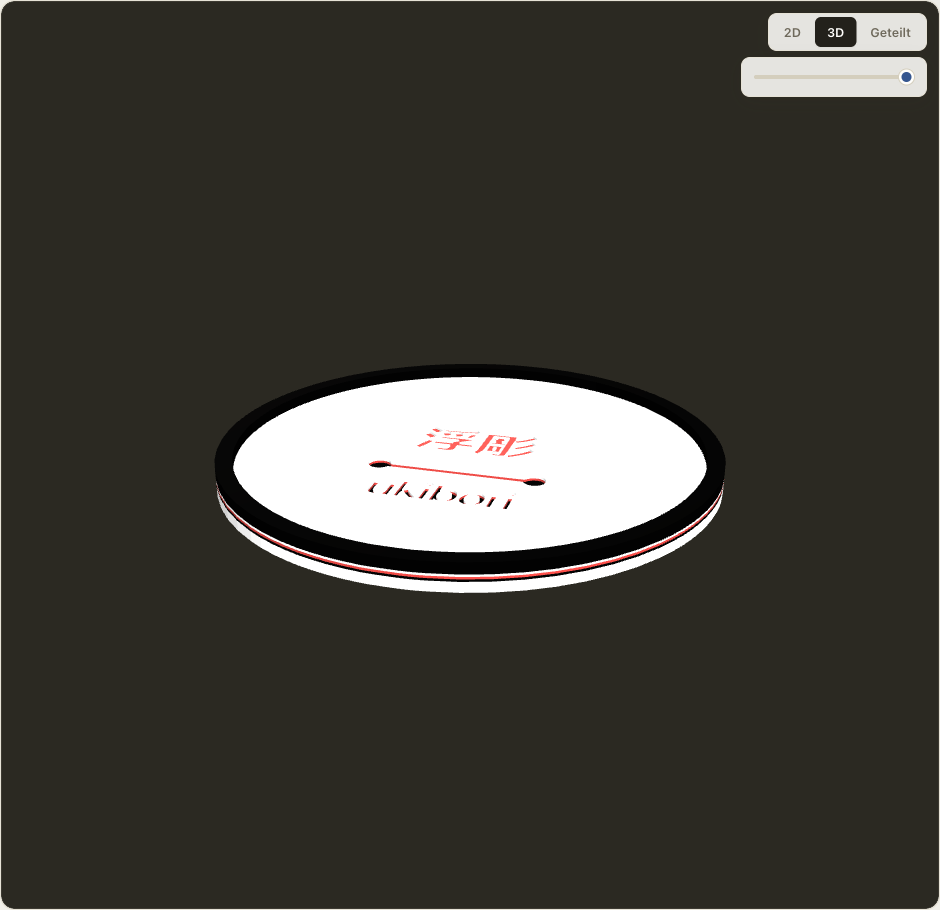
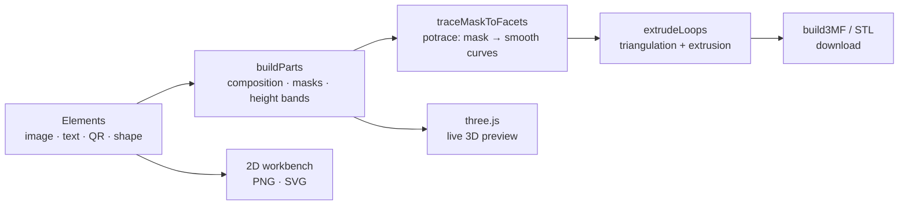
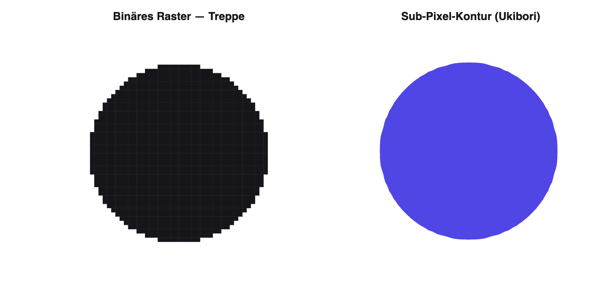
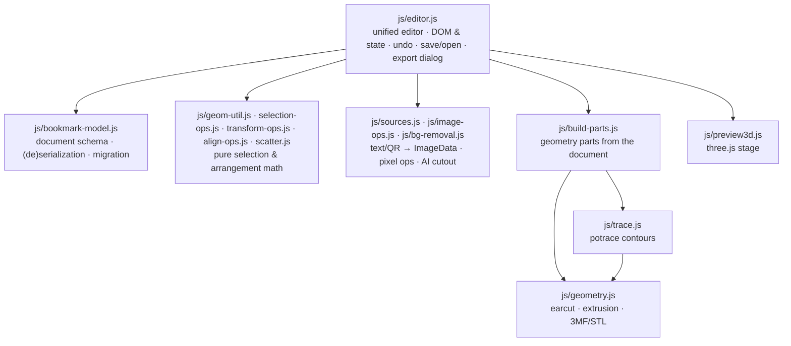

<div align="center">


# Ukibori · 浮彫

**Turn images, text, and shapes into 3D-printable reliefs — right in your browser.**

Image · Text · QR · Rectangle & Circle → Relief · Raised & Engraved · AMS multi-color · AI cutout · Live 3D · 100% local.




</div>

---

## ✨ Why Ukibori?

> *Ukibori* (Japanese **浮彫**, "raised relief") turns a photo, logo, or piece
> of lettering into a **physical object** in seconds — no CAD, no account, no
> cloud.

- 🧩 **From draft to print in one step.** Drop elements onto the workpiece,
  drag a few sliders, export a `.3mf` — ready for the slicer. Every component
  is written as its own single-color object, ideal for
  **multi-color/AMS printing**.
- 🪶 **Smooth instead of pixelated.** Vectorized contours (potrace) produce
  soft curves and clean round edges — even from low-resolution sources (see
  [How it works](#-how-it-works)).
- 🔒 **Your images stay yours.** Everything is computed in the browser. No
  upload, no server, no tracking — it even works offline.
- ⚡ **No build, no CDN.** Runs from static files without a toolchain. The
  libraries it uses (three.js, ONNX runtime + cutout model, QR encoder,
  potrace) are **bundled locally** — nothing is fetched at runtime.

**What for?** Coasters · door & shelf signs · logo plaques · fridge magnets · keychains · name & wifi-QR signs · stamp templates · decorative reliefs.

> [!NOTE]
> The app's user interface is currently German. Where this README refers to
> specific controls, it quotes their German labels.

---

## 🖼️ The workshop

A three-column layout in a "paper & ink" look: on the left the **document**
panel (workpiece · stacking · print), in the middle the **stage** with the 2D
workbench and a dark 3D view (switchable **2D / 3D / Split**), on the right the
**element inspector** with the add dock and, below it, the Photoshop-style
**layers dock**. New project, undo/redo, snapping options, and the export
dialog sit in the topbar.

| 2D workbench | Raised („Erhaben“) | Engraved („Vertieft“) |
| :---: | :---: | :---: |
|  |  |  |
| Drag, scale, rotate, snap — with guides | Motifs stack as prisms on the plate | Motifs engrave into the plate; the color bands stay visible |

- **Layers dock** — every row with a thumbnail/chip and a print badge (↑/↓
  height in mm, ✎ for a manual override, „bündig“ for flush; for
  color-layer/heightmap elements, the mode), single-color rows additionally
  show a color dot;
  **sortable via drag & drop**, hovering reveals visibility, duplicate (⧉),
  ▲/▼, and a trash can. Groups appear as collapsible nested rows.
- **Multi-select** — drag a marquee over empty canvas or <kbd>Shift</kbd>-click
  to build a selection; move, delete, duplicate, and nudge it as one, or scale
  and rotate the whole selection uniformly via its selection box.
- **Groups** — group elements (nesting supported) to move and manage them
  together; grouping never changes the printed geometry.
- **Floating selection toolbar** on the stage: duplicate, center (↔/↕),
  **mirror H/V**, and delete — plus, for multi-selections, group/ungroup,
  **align** (left · center · right · top · middle · bottom) and **distribute**
  (horizontal/vertical).
- **Scatter („Streuen“)** — sprinkle randomized copies of an element across the
  plate or a region you drag out: count, rotation and scale ranges, optional
  overlap avoidance, re-roll, live preview; applying commits the copies as a
  group.
- **Layer preview** — a slider cuts the 3D model from the top, continuously,
  like a slicer scrubber.
- **Undo/redo** across the whole document (up to 30 stored states,
  <kbd>Ctrl/Cmd</kbd>+<kbd>Z</kbd>).
- **Snapping** — to plate edges/center, to other elements, or to a mm grid,
  with dashed guides while dragging; configured via the lock popover in the
  topbar (persisted locally).
- **Thin-feature check** — marks areas narrower than the 0.4 mm nozzle as a
  red overlay in the 2D view, before the print swallows them.
- **Empty stage?** A clickable hero card greets you — a click opens the image
  dialog, drag & drop lands straight on the workpiece, and a button loads the
  built-in **example coin**.
- **New („Neu“)** — clears the workpiece for a fresh start;
  <kbd>Ctrl/Cmd</kbd>+<kbd>Z</kbd> brings the old project back.

---

## 🎨 Features

### Elements

- **Five element types** — load an **image**, type **text**, generate a
  **QR code**, or draw a shape (**rectangle** / **circle**); they all flow
  through the same relief pipeline.
- **Shapes are vectors** — rectangle and circle rasterize razor-sharp at any
  size and resolution; the circle becomes an **ellipse** as soon as width ≠
  height, and the kind can be switched later in the inspector.
- **Mirroring** — flip any element horizontally/vertically; the state carries
  through 2D, 3D, and all exports.
- **Duplicate** — via <kbd>Ctrl/Cmd</kbd>+<kbd>D</kbd>, the selection toolbar,
  or the ⧉ action right in the layer row; the copy lands slightly offset above
  the original.
- **Three depth modes per element** — **„Einfarbig“** (single color: silhouette
  by threshold), **„Farbebenen“** (color layers: palette via median cut), or
  **„Höhenrelief“** (heightmap: brightness → height, finely stepped into print
  layers).
- **Cut out as hole** — any element can punch through the plate instead of
  printing.
- **AI cutout** — a local model (u2netp via onnxruntime-web) removes the image
  background right in the browser; the image never leaves the device.
  *(Requires HTTP serving — Option B below; the feature is disabled when the
  app is opened via double-click/`file://`.)*
- **Transparency preserved** — cut-out motifs stay transparent (preview, PNG,
  **and** 3D: transparent areas are left out of the geometry).
- **Fonts** — system fonts + **bold**, or load your own
  **`.ttf`/`.otf`/`.woff`/`.woff2`** (embedded locally and saved with the
  project).

### Workpiece

- **Four plate shapes** — **rectangle** (with corner radius), **circle**,
  **free** (the plate follows the image silhouette), or **image** (a plateless
  object).
- **Frame** with custom width, height, and color — the classic coaster rim; on
  the free-form plate the ring follows the outer contour.
- **Mounting** — a **hole** for hanging/screwing, or an **eyelet („Öse“)** — an
  attached tab with a hole — placed via a draggable marker; the eyelet always
  stays connected to the plate edge.

### Relief & colors

- **Raised or engraved** — globally for all layers, plus switchable per element
  (for single-color and color-layer elements; heightmap reliefs always build
  upward on the plate).
- **Color relief, three stacking styles** — **„Gestuft“** (stepped: heights by
  rank), **„Eine Fläche“** (all colors on one level), or
  **„AMS-Farbschichten“** (one color per print layer, made for filament
  changes).
- **AMS filament palette** — one shared, ordered color-layer list for the whole
  model: **add** colors, **drag to reorder**, or **remove** them — the pixels
  of a removed color snap to the closest remaining layer (smooths noisy
  images). All AMS elements (and, via „Höhe je Farbe“, single-color elements
  too) snap to the same layers; explicit **merging** of two colors is offered
  by the element palette of the „Gestuft“/„Eine Fläche“ styles.
- **Height per color (AMS layers)** — single-color elements get their height
  automatically from their color: same color = same level, each additional
  color one step higher. <details><summary>Details</summary>

  - **Raised** prints the workpiece as **one** stack of solid single-color
    full layers — lower colors run underneath higher ones, and every print
    layer stays single-color.
  - **Engraved** instead splits the base plate into solid color bands; the
    plate top stays — without a top coat — one continuous base-color band, and
    base-colored elements stay flush within it. The frame's substructure is
    banded along with it.
  - The **top coat („Deckschicht“)** optionally lays an extra color as the
    topmost level of the workpiece — raised, as a surface above the plate on
    which the color motifs stack (base-colored and manually pinned elements
    still punch through); engraved, as the topmost plate band through which
    the motifs engrave.
  - The **relief height** acts as a manual override per element (the
    placeholder shows the auto value, the **Auto** button restores it).
  - Can be turned off with a checkbox; old projects keep their manual heights.
  </details>

### Preview, save & export

- **Live 3D preview** — a rotatable, zoomable, pannable three.js view of the
  exact print model; the camera starts from the front, slightly tilted toward
  the workpiece.
- **Export dialog** — **PNG**, vectorized **SVG** (potrace), **`.3mf`** (every
  component as its own single-color object — ideal for multi-color/AMS
  printing), and universal **`.stl`**, with a custom filename; the name of the
  first loaded image is suggested automatically.
- **Save / Open** — download the project as a `.json` file and load it again
  (a full round trip incl. image sources, fonts, and depth settings).

---

## ⌨️ Keyboard & mouse

| Shortcut | Effect |
| --- | --- |
| <kbd>Ctrl/Cmd</kbd>+<kbd>Z</kbd> · <kbd>Ctrl/Cmd</kbd>+<kbd>⇧</kbd>+<kbd>Z</kbd> | Undo · Redo |
| <kbd>Ctrl/Cmd</kbd>+<kbd>D</kbd> | Duplicate the selection |
| <kbd>Ctrl/Cmd</kbd>+<kbd>G</kbd> · <kbd>Ctrl/Cmd</kbd>+<kbd>⇧</kbd>+<kbd>G</kbd> | Group · Ungroup |
| <kbd>Del</kbd> / <kbd>⌫</kbd> | Delete the selection |
| <kbd>Tab</kbd> / <kbd>⇧</kbd>+<kbd>Tab</kbd> | Select next/previous element |
| <kbd>Arrow keys</kbd> · with <kbd>⇧</kbd> | Move the selection 1 mm · fine (0.25 mm) |
| <kbd>⇧</kbd> while corner-scaling | Keep aspect ratio |
| <kbd>Esc</kbd> | Clear the selection |

**2D stage:** drag over empty canvas = marquee selection · <kbd>Shift</kbd>+click = add/remove an element · mouse wheel = zoom toward the cursor · middle button or <kbd>Space</kbd>+drag = pan · the % chip resets to fit.

**3D stage:** drag = rotate · right/middle button or <kbd>⇧</kbd>+drag = pan · mouse wheel = zoom.

---

## 🚀 Getting started

No build step, no installation.

```sh
# Option A — just open it
open index.html            # or double-click it in your file manager

# Option B — serve locally (recommended; enables the AI cutout)
python3 -m http.server 8000
# → http://localhost:8000/
```

Then: **drop an image onto the stage (or + Text / + QR / + Rechteck /
+ Kreis) → tune the parameters → export a PNG or a 3D model (.3mf).**

> [!TIP]
> Try it right away: the coin from the screenshots ships as a built-in
> example — the **„Beispiel öffnen“** button on the empty stage, or
> **Öffnen** → [`examples/ukibori-coin.json`](examples/ukibori-coin.json).

---

## 🧠 How it works

The 2D workbench renders the document WYSIWYG onto a canvas; PNG and SVG export
reuse the same drawing routine on their own offscreen canvases at print
resolution. For the 3D model, the engine rasterizes every element into masks on
the print grid and retraces the contours as smooth curves:



### Smooth edges instead of pixel stairs

Naive image-to-relief converters trace the contour along the **pixel edges** —
the result is a visible staircase. Ukibori instead rasterizes the document onto
a fine mm grid — plate shape, frame, and eyelet from analytic distance fields,
images and text via their alpha channel — and vectorizes the resulting mask
with the locally bundled **potrace** into smooth **Bézier curves** instead of
following the pixel edges.

<div align="center">

</div>

The model is stacked in z layers: **base plate** (split into color bands if
needed) → **elements** (prisms or engravings) → **frame/eyelet** — every
component as its own colored object in the `.3mf`.

### Architecture



`buildParts()` is the single geometry source: the live 3D preview and the
3MF/STL exports render exactly the same parts — what you preview is what you
print.

| File | Role |
| --- | --- |
| `index.html` | Markup: topbar, three panels, stage, export dialog, favicon |
| `styles.css` | "Paper & ink" workshop look, three-column layout, layers dock |
| `js/editor.js` | Unified editor: DOM & state, canvas rendering, selection/drag/snapping, groups & scatter UI, undo, save/open, export dialog, 2D/3D/split |
| `js/bookmark-model.js` | v2 document schema (`defaultDoc`, `makeElementV2`), serialization, migration from v1 |
| `js/build-parts.js` | builds the geometry parts (plate, color bands, elements, frame, eyelet) for the 3D preview and export |
| `js/geom-util.js` | rotated-rectangle math (corners, bounding boxes) shared by selection, transform, align, and scatter |
| `js/selection-ops.js` | pure selection helpers (marquee hit testing) |
| `js/transform-ops.js` | multi-select/group transform math (move, uniform scale, rotate) |
| `js/align-ops.js` | align/distribute math |
| `js/scatter.js` | seeded scatter generator |
| `js/geometry.js` | extrusion & triangulation (earcut), plate-shape distance fields, 3MF/STL generation |
| `js/image-ops.js` | pure pixel operations: threshold, islands, median cut, … |
| `js/sources.js` | text & QR input → ImageData |
| `js/bg-removal.js` | AI background removal (u2netp via onnxruntime-web) |
| `js/preview3d.js` | live 3D preview (three.js, scene built from `buildParts()`) |
| `js/trace.js` · `js/vendor/potrace.js` | potrace contouring: masks → smooth curves for all 3D parts and the SVG export |
| `js/bookmark-export.js` | palette helpers (median cut, color mapping); plus the old v1 export path, kept as the reference for parity tests |
| `js/example-project.js` | the built-in example coin (mirrors `examples/ukibori-coin.json`, so it also works over `file://`) |
| `js/coachmarks.js` | first-run tour (coach marks) |
| `vendor/` | bundled locally: three.js, onnxruntime-web (+ WASM) with `u2netp.onnx`, QR encoder |
| `examples/` | example projects to open — including the coin from the screenshots above |
| `tests/` | browser test suite — `tests/run.html` runs all `*.test.js` files (327 tests) |

Plain HTML/CSS/JavaScript, **no build step and no CDN**. Some features (3D
preview, AI cutout, QR, SVG tracing) use libraries that are **bundled locally**
— nothing is fetched from the network at runtime.

---

## 🔒 Privacy

All processing happens locally in the browser. Images are **not** uploaded,
stored, or sent to third parties — the **AI cutout**, too, runs on a locally
bundled model right in the browser. The app works fully offline.

<div align="center">
<sub>Built entirely locally in the browser · 浮彫</sub>
</div>
