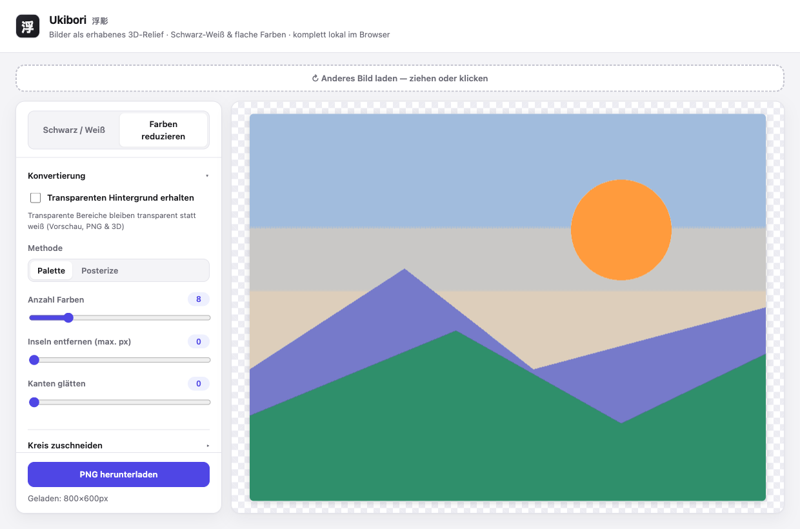
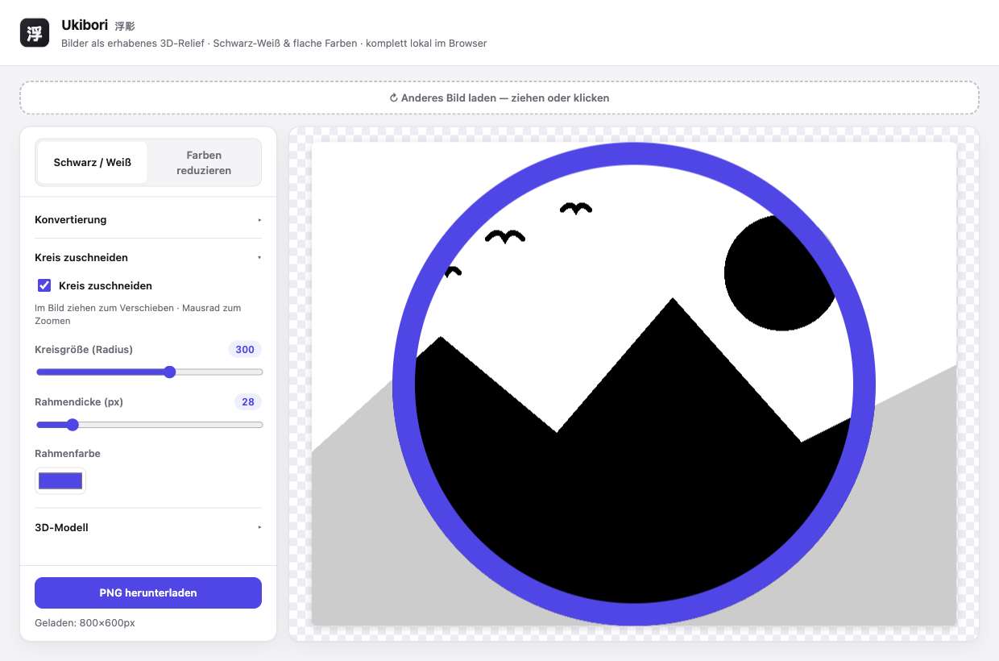
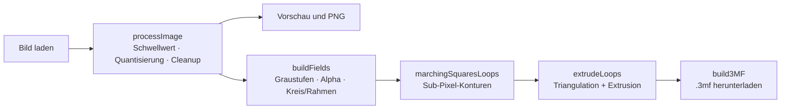
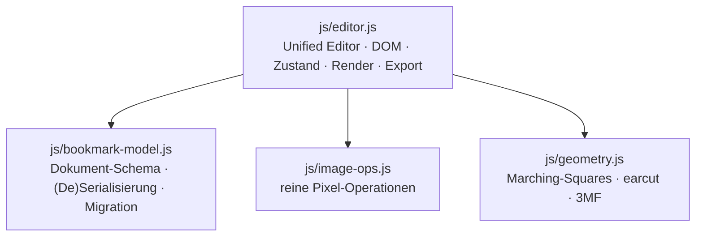

<div align="center">


# Ukibori · 浮彫

**Verwandle jedes Bild in ein erhabenes 3D-Relief — direkt im Browser.**

Bild · Text · QR → Relief · Schwarz-Weiß, Farbe & AMS-Mehrfarb · KI-Freistellung · 3D-Vorschau · 100 % lokal.


</div>

---

## ✨ Warum Ukibori?

> *Ukibori* (jap. **浮彫**, „erhabenes Relief") macht aus einem Foto, Logo oder
> Schriftzug in Sekunden ein **physisches Objekt** — ohne CAD, ohne Konto, ohne
> Cloud.

- 🧩 **Vom Bild zum Druck in einem Schritt.** Laden, Schwellwert ziehen, `.3mf`
  exportieren — fertig für den Slicer. Jede Farbe wird als eigenes Objekt
  ausgegeben, ideal für **Mehrfarb-/AMS-Druck**.
- 🪶 **Glatt statt verpixelt.** Sub-Pixel-Konturen liefern weiche Kurven und
  saubere runde Ränder — auch bei niedriger Auflösung (siehe [Technik](#-wie-es-funktioniert)).
- 🔒 **Deine Bilder bleiben deine.** Alles rechnet im Browser. Kein Upload,
  kein Server, kein Tracking — funktioniert sogar offline.
- ⚡ **Kein Build, kein CDN.** Läuft aus statischen Dateien ohne Toolchain. Die
  genutzten Bibliotheken (three.js, ONNX-Laufzeit + Freistell-Modell, QR-Encoder,
  potrace) sind **lokal mitgeliefert** — zur Laufzeit wird nichts nachgeladen, alles
  funktioniert offline.

**Wofür?** Untersetzer · Tür- & Regalschilder · Logo-Plaketten · Kühlschrank­magnete · Schlüsselanhänger · Namens- & WLAN-QR-Schilder · Stempel-Vorlagen · Deko-Reliefs.

---

## 🎨 Funktionen

| Schwarz / Weiß | Farben reduzieren | Runder Untersetzer |
| :---: | :---: | :---: |
|  |  |  |
| Schwellwert · Auto (Otsu) · Invertieren · Inseln entfernen | Palette (Median-Cut) oder Posterize · Kanten glätten | Verschieb- & zoombarer Kreis · Rahmen in Wunschfarbe |

- **Drei Eingabequellen** — **Bild** laden, **Text** tippen oder einen **QR-Code**
  erzeugen; alle drei fließen in dieselbe Relief-Pipeline.
- **Zwei Konvertierungsmodi** — kontrastreiches Schwarz-Weiß oder flache,
  poster­artige Farbflächen.
- **KI-Freistellung** — lokales Modell (u2netp via onnxruntime-web) entfernt den
  Hintergrund direkt im Browser; das Bild verlässt das Gerät nicht.
  *(Erfordert HTTP-Serving — „Variante B" oben; per Doppelklick/`file://` ist die Funktion deaktiviert.)*
- **Kreis-Zuschnitt** mit erhabenem Rand — der klassische runde Untersetzer.
- **Befestigung** — **Loch** zum Aufhängen/Verschrauben oder **Öse** (verstärkter
  Ring), per ziehbarem Marker frei platziert.
- **Einfach/Erweitert-Umschalter** — der Einfach-Modus bietet kompakte Bedienelemente für Gelegenheitsnutzer; der Erweitert-Modus schaltet Ebenen-Liste, Tiefenmodus, Umwandlungsparameter und per-Element-Richtungssteuerung frei.
- **Transparenz erhalten** — freigestellte Motive bleiben transparent (Vorschau,
  PNG **und** 3D: transparente Bereiche werden ausgespart).
- **3D-Export** — **`.3mf`** (jede Farbe als eigenes Objekt für Mehrfarb-/AMS-Druck),
  universelles **`.stl`** und vektorisiertes **`.svg`** (potrace) — über den
  Export-Dialog mit eigenem Dateinamen.
- **Farb-Relief, drei Stapel-Stile** — **Gestuft** (Rang-Höhen), **Eine Fläche**
  (alle Farben auf einer Ebene) oder **AMS-Farbschichten** (eine Farbe pro Druck­schicht,
  gemacht für Filament-Wechsel). Funktioniert erhaben **und** vertieft.
- **AMS-Filament-Palette** — eine gemeinsame, geordnete Farbschicht-Liste fürs ganze
  Modell: Farben **hinzufügen**, per **Ziehen umsortieren** (welche Farbe auf welcher
  Schicht druckt) und **zusammenführen** (zwei Farben teilen sich eine Schicht — glättet
  verrauschte Bilder). Alle Elemente rasten auf dieselben Schichten ein, sodass gleiche
  Farben eine Schicht teilen. Im vertieften AMS-Modus wird auch die **Grundplatte** passend
  in Farbschichten geteilt, damit jede Druck­schicht einfarbig bleibt.
- **Höhe je Farbe (AMS-Ebenen)** — Einfarbig-Elemente drucken als **ein gemeinsamer
  Ebenen-Stapel**: das Werkstück wird wie im AMS-Modus in **massive einfarbige
  Schichten** geteilt — Ebene 1 läuft als durchgehende Schicht auch unter höheren
  Farben durch, jede weitere Farbe stapelt eine Stufe höher (Palette-Reihenfolge
  zuerst, sonst Ebenen-Reihenfolge; gleiche Farbe = gleiche Ebene). Elemente in der
  **Grundfarbe** bleiben bündig auf Plattenhöhe und stanzen durch den Stapel. Die
  **Relief-Höhe** wirkt als manueller Override pro Element (leer = automatisch; das
  Element druckt dann als eigenes Prisma in seiner Farbe). Abschaltbar per Häkchen;
  alte gespeicherte Projekte behalten ihre manuellen Höhen.
- **Helligkeit → Höhe** — kontinuierliches Höhenrelief direkt aus der Bildhelligkeit.
- **Schriftarten** — System-Schriften + **Fett**, oder eine eigene **`.ttf`/`.otf`/`.woff`**
  laden (lokal eingebettet und im Projekt gespeichert).
- **Live-3D-Vorschau** — dreh- & zoombare three.js-Ansicht des exakten Druck­modells
  (2D⇄3D-Umschalter).
- **Vorlagen** — Einstellungen werden gespeichert; mitgelieferte Presets
  (Untersetzer / Schild / Magnet).
- **Speichern / Öffnen** — Projekt als `.json`-Datei herunterladen und wieder laden (vollständige Rundreise inkl. Bildquellen und Tiefen-Einstellungen).
- **PNG-Export** der umgewandelten Grafik · Live-Vorschau mit Transparenz-Karomuster.

---

## 🚀 Loslegen

Kein Build-Schritt, keine Installation.

```sh
# Variante A — einfach öffnen
open index.html            # bzw. Doppelklick im Dateimanager

# Variante B — lokal servieren (empfohlen)
python3 -m http.server 8000
# → http://localhost:8000/
```

Dann: **Bild per Drag & Drop laden → Parameter in der Seitenleiste einstellen →
PNG oder 3D-Modell (.3mf) exportieren.**

---

## 🧠 Wie es funktioniert

Eine Bild-Pipeline für die 2D-Ausgabe, und ein darauf aufbauender Feld-basierter
Pfad für das glatte 3D-Modell:



### Glatte Kanten statt Pixel-Treppe

Naive Bild-zu-Relief-Konverter ziehen die Kontur entlang der **Pixelkanten** —
das Ergebnis ist eine sichtbare Treppe. Ukibori übersetzt das Bild stattdessen in
**kontinuierliche Felder** (Graustufen-Deckungsgrad für Schwarz/Weiß, Alpha für
Transparenz, analytische Distanzfelder für Kreis & Rahmen) und extrahiert die
Kontur per **interpolierter Marching-Squares** mit Sub-Pixel-Genauigkeit.

<div align="center">

</div>

Das Relief wird in z-Schichten gestapelt: **Grundplatte** → **Relief**
(Schwarz/Weiß in eigenen Dicken) → **Rand/Ring** — jede Komponente als eigenes,
eingefärbtes Objekt im `.3mf`. Der **Glättung**-Regler dient nur noch der
optionalen leichten Nachglättung.

### Architektur



| Datei | Rolle |
| --- | --- |
| `index.html` | Markup, Einbindung von CSS/JS, Favicon |
| `styles.css` | Layout, Sidebar, Akkordeon-Optionen, Export-Dialog |
| `js/editor.js` | Unified Editor: Einfach/Erweitert-Ansicht, Canvas-Rendering, Drag & Drop, Speichern/Öffnen, Export |
| `js/bookmark-model.js` | v2-Dokument-Schema (`defaultDoc`, `makeElementV2`), Serialisierung, Migration von v1 |
| `js/coachmarks.js` | Erster-Start-Tutorial (Coach-Marks) |
| `js/image-ops.js` | Schwellwert, Otsu, Inseln, Posterize, Median-Cut, Kreismaske |
| `js/geometry.js` | Sub-Pixel-Konturen, Triangulation (earcut), 3MF/STL-Erzeugung |
| `js/sources.js` | Text- & QR-Eingabe → ImageData |
| `js/bg-removal.js` | KI-Freistellung (u2netp via onnxruntime-web) |
| `js/preview3d.js` | Live-3D-Vorschau (three.js, Szene aus `buildParts()`) |
| `js/build-parts.js` | Baut die geometrischen Teile aus dem Dokument für 3D-Vorschau und Export |
| `js/trace.js` | potrace-Tracing (SVG-Export) |
| `vendor/` | lokal mitgelieferte Bibliotheken: three.js, onnxruntime-web + `u2netp.onnx`, qrcode, potrace |
| `favicon.svg` | Marken-Favicon (Kanji 浮, geprägt) |
| `docs/superpowers/specs/` · `docs/superpowers/plans/` | Design- & Umsetzungs-Dokumente je Feature |

Reines HTML/CSS/JavaScript, **kein Build-Schritt und kein CDN**. Einige Funktionen
(3D-Vorschau, KI-Freistellung, QR, SVG-Tracing) nutzen Bibliotheken, die **lokal unter
`vendor/` mitgeliefert** werden — zur Laufzeit wird nichts nachgeladen.

---

## 🔒 Datenschutz

Die gesamte Verarbeitung passiert lokal im Browser. Bilder werden **nicht**
hochgeladen, gespeichert oder an Dritte gesendet — auch die **KI-Freistellung**
läuft mit einem lokal mitgelieferten Modell direkt im Browser. Die App funktioniert
vollständig offline.

---

## 📚 Mehr

Die Entwurfs-/Design-Dokumente der einzelnen Features liegen unter
[`docs/superpowers/specs/`](docs/superpowers/specs/) — von der ersten
Schwarz-Weiß-Konvertierung über den Rechteck-Relief-Export und die
Transparenz-Unterstützung bis zur Sub-Pixel-Kontur.

<div align="center">
<sub>Komplett lokal im Browser gebaut · 浮彫</sub>
</div>
